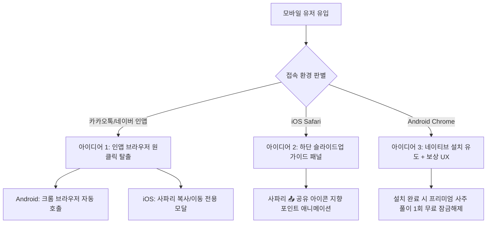

# 모바일 퍼스트(Mobile-First) PWA 설치 혁신 아이디어 및 설계 기획서

대부분의 소비자가 데스크톱 대신 스마트폰을 통해 유입되는 현실에서, 모바일 PWA 환경을 **"초보자도 클릭 몇 번으로 쉽게 인지하고 설치할 수 있도록"** 전환하는 모바일 중심 기획안입니다. 

단순히 "설치 버튼"을 크게 만드는 1차원적 접근을 넘어, 모바일 유저의 이탈 장벽(특히 카카오톡 인앱뷰, iOS 공유 프로세스)을 근본적으로 극복하기 위한 기획 아이디어를 정리했습니다.

---

## 🛠️ 핵심 아이디어 아키텍처



---

## 💡 아이디어 상세 분석

### 아이디어 1: 카카오톡·네이버 인앱 브라우저 "스마트 원클릭 탈출" 기술 구현
소비자가 인스타그램 광고, 카카오톡 공유 링크 등을 통해 들어올 때 PWA 설치가 되지 않는 문제를 근본적으로 우회합니다.

* **안드로이드 (Chrome 자동 실행)**:
  안드로이드 기기에서 카카오톡 인앱 브라우저로 들어온 경우, 자바스크립트를 이용해 사용자의 액션 없이도 즉시 기기 기본 브라우저(Chrome)로 해당 주소를 다시 띄우는 크롬 인텐트(Intent) 스크립트를 삽입합니다.
  ```javascript
  // 안드로이드 카카오톡 인앱 브라우저 자동 탈출 스크립트 예시
  if (/kakaotalk/i.test(navigator.userAgent) && /android/i.test(navigator.userAgent)) {
      location.href = "intent://" + location.host + location.pathname + location.search + "#Intent;scheme=https;package=com.android.chrome;end";
  }
  ```
* **iOS (사파리 이동 안내 스크린)**:
  아이폰 카카오톡 환경에서는 인텐트 주소가 막혀 있기 때문에, 첫 화면에 다른 복잡한 메뉴를 모두 가리고 **[사파리에서 열기 🧭]** 또는 **[링크 복사하기]** 기능만 크게 강조한 심플 랜딩 페이지를 노출하여 이탈을 최소화합니다.

---

### 아이디어 2: iOS 유저를 위한 "하단 슬라이드업(Slide-up) 가이드 패널"
아이폰 사용자는 '공유 버튼을 눌러 홈 화면에 추가한다'는 흐름을 직관적으로 이해하지 못합니다. 실제 아이폰 화면 하단 인터페이스와 동기화된 가이드를 제공합니다.

* **동작 방식**: iOS 유저가 웹페이지 진입 후 3초가 지나거나 특정 기능을 누르면, 화면 하단에서 모바일 앱의 Bottom Sheet처럼 부드러운 패널이 올라옵니다.
* **디자인 구현**:
  1. 사파리 하단 툴바 영역 바로 위에 가리키는 **움직이는 화살표(핑거 모션)**와 함께 설명 패널을 올립니다.
  2. 패널 내부에는 텍스트를 최소화하고, 귀여운 일러스트 아이콘으로 **[1단계: 📤 클릭] -> [2단계: '홈 화면에 추가' 클릭]** 과정을 시각적으로 즉각 보여줍니다.
  3. "이 과정은 5초 안에 끝나며 별도의 앱스토어 로그인 없이 즉시 설치됩니다"라는 안심 문구를 삽입합니다.

---

### 아이디어 3: "설치 혜택 보상(리워드) 시스템" 융합
초보자에게 단순한 기능 중심의 '설치 요청'은 귀찮은 작업일 뿐입니다. 사주/운세 도메인의 매력을 결합해 가치를 먼저 보여줍니다.

* **시나리오**:
  1. 사용자가 운세 페이지에서 무료 운세 결과를 절반쯤 읽었을 때, 가장 궁금해하는 핵심 결과(예: *"나의 올해 대박나는 달"* 등)를 블러(흐림) 처리합니다.
  2. 흐림 처리 위에 **"홈 화면에 앱으로 추가하고 3초 만에 무료로 전체 풀이 확인하기"** 버튼을 제공합니다.
  3. 사용자가 동기부여가 극대화된 상태에서 버튼을 클릭하면 PWA 설치 프로세스가 발동하고, 설치가 완료되면 숨겨진 콘텐츠가 즉시 해제(Unlock)되거나 프리미엄 운세 무료 쿠폰이 지급됩니다.

---

### 아이디어 4: 완벽한 "앱 체감(App-Like)" 연출로 웹 브라우저 잔재 지우기
PWA가 일단 설치된 후에는 일반 모바일 웹사이트와 차별화된 사용 경험을 주어 소비자가 실제 구글 플레이스토어에서 받은 네이티브 앱으로 착각하도록 완성도를 끌어올립니다.

* **스플래시 화면(Splash Screen)**: 앱 아이콘을 터치해 켤 때 브라우저 흰색 빈 화면이 아닌, 황금빛 태극 로고가 서서히 나타나는 미려한 부팅 애니메이션(Splash Screen)을 모바일에 최적화하여 구현합니다.
* **상단 주소창 감추기**: PWA manifest 설정의 `display` 값을 `standalone` 혹은 `fullscreen`으로 확실히 적용해, 브라우저 상단 주소창이나 하단 뒤로가기 바를 숨기고 넓은 화면 전체를 디자인 영역으로 사용합니다.
* **햅틱 피드백**: 버튼을 터치할 때 모바일 진동 API(`navigator.vibrate`)를 미세하게 호출하여 네이티브 앱 특유의 쫀쫀한 터치감을 흉내 냅니다.

---

## 📋 실현을 위한 구체적인 실행 로드맵

1. **1단계 (즉시 적용)**:
   * 카카오톡 인앱 브라우저 크롬 자동 호출 스크립트 작성
   * iOS 접속자를 위한 사파리 툴바 방향 지시 하단 슬라이드업 컴포넌트 탑재
2. **2단계 (기획 고도화)**:
   * '무료 혜택' 연동 설치 리워드 UX 기획
   * 로딩 화면 스플래시 이미지 세분화 적용
3. **3단계 (안정화 및 대안)**:
   * 웹에서의 허들을 다 뛰어넘어도 실패하는 유저를 위해, 결국 공식 플레이스토어/앱스토어 링크 버튼도 서브로 제공


## 🛠️ 구현 및 수정 완료 파일 리스트
```
1. HTML: 
  
    index.html
    (하단에 iOS용 Bottom Sheet 가이드 및 인앱 경고 모달 마크업 추가)

2.CSS: 

    style.css
    (Bottom Sheet 슬라이딩 모션 애니메이션, 손가락 튕김 키프레임, 모바일 전용 반응형 레이아웃 스타일 250줄 추가)

3. JS: 

    script.js
 (인앱 브라우저 탐출 감지 엔진, iOS 환경 감지 시 설치버튼 강제 노출 및 툴팁/Bottom Sheet 노출 제어 스크립트 결합)
```

## 📱 적용된 실질적 UX 개선점
```
1. 안드로이드 카카오톡·네이버 인앱 브라우저 자동 탈출
사용자가 안드로이드 카카오톡이나 네이버 안에서 링크를 누르면 웹페이지가 로드되는 순간, 카카오톡 웹뷰를 강제 종료하고 스마트폰의 크롬(Chrome) 기본 브라우저를 자동으로 실행하도록 시스템 인텐트(Intent) 링크를 작동시켰습니다.
이로써 안드로이드 유저는 설치 불가능한 인앱 웹뷰를 벗어나 크롬에서 바로 "앱 설치하기" 버튼을 눌러 홈 화면에 설치할 수 있게 되었습니다.
2. iOS 인앱 브라우저 전용 사파리 이동 모달 추가
iOS 카카오톡이나 네이버는 시스템적으로 강제 브라우저 전환이 차단되어 있기 때문에, 인앱 접속이 감지되면 화면 전체를 덮는 고급스러운 사파리 이동 안내 모달을 띄웁니다.
[주소 복사하기] 버튼을 원클릭으로 터치하면 서비스 주소가 복사되고, "사파리(Safari) 앱을 켜고 주소창에 붙여넣어 주세요"라는 친절한 얼럿 창이 나와 이탈을 최소화합니다.
3. iOS(아이폰) 일반 사파리 접속 시 "앱 설치 가이드" 버튼 활성화
iOS Safari는 브라우저가 먼저 설치 이벤트를 제안하지 않기 때문에 이전 코드에서는 설치 버튼이 아예 숨어 있었습니다.
이제 사용자의 디바이스가 iOS(아이폰)이고 홈 화면에 추가되지 않은 상태(!standalone)라면, 상단에 [📥 앱 설치 가이드] 버튼을 강제로 활성화하여 클릭을 유도합니다.
4. iOS 전용 하단 슬라이드업(Bottom Sheet) 가이드 패널 구현
아이폰 사용자가 [📥 앱 설치 가이드] 버튼을 터치하면 화면 하단에서 모바일 전용 Bottom Sheet 안내창이 부드럽게 슬라이딩되어 올라옵니다.
텍스트 위주가 아닌 [1단계: 공유 버튼 📤 터치] -> [2단계: 홈 화면에 추가 터치] -> [3단계: 추가 완료] 순서의 번호가 매겨진 명확한 지침 레이아웃과, 하단부 툴바 위치를 짚어주며 튕기는 손가락 지시 애니메이션(fa-hand-pointer)이 함께 작동하여 초보자도 5초 안에 홈 화면 추가를 마칠 수 있습니다.
```